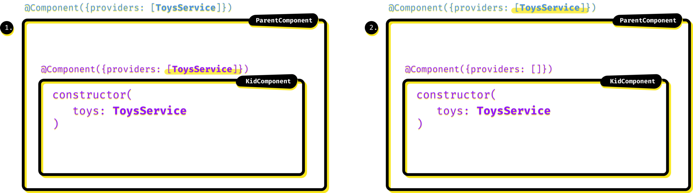
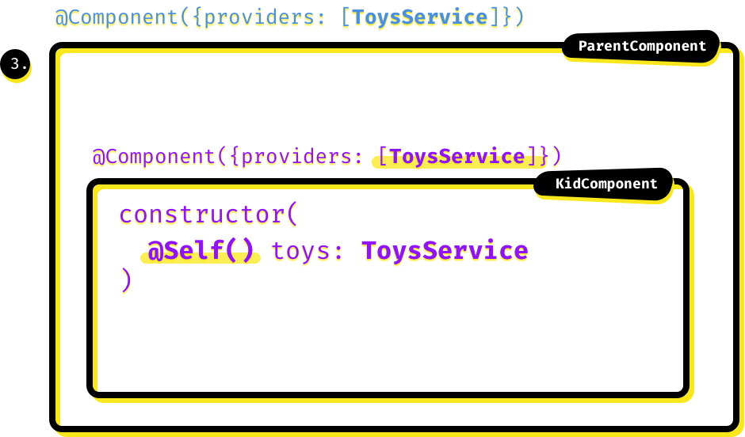
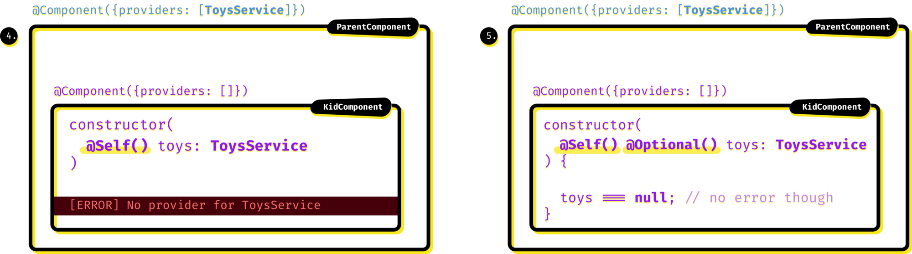
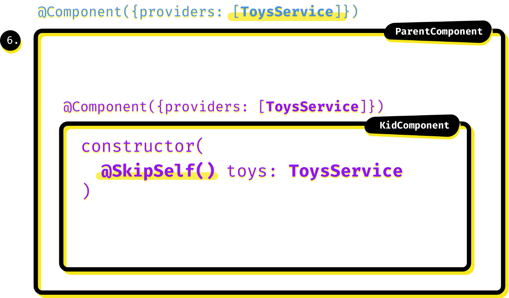
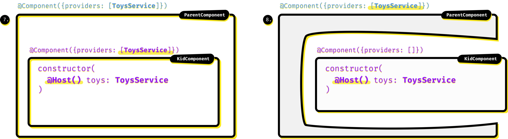

# Decoratori

## Default 

Per impostazione predefinita, Angular controlla innanzitutto se il componente definisce un iniettore di dipendenza nel proprio decoratore. In caso affermativo _\( **1.** \)_ , il componente \(in particolare: ciascuna delle sue istanze\) riceverà la propria istanza del servizio. Se non trova sul componente, cercherà un iniettore genitore \(ad es. Il componente genitore _\( **2.** \)_ , i suoi antenati ecc.\), Su l'albero degli iniettori e alla fine si fermerà sull'istanza dell'intera applicazione del servizio definito su una delle nostre `NgModule`s. A meno che non sia nemmeno lì, nel qual caso avremo un `No provider`errore " ".

## @Self\(\) 

Se decoriamo il parametro con `@Self()`, è come se ci fosse solo il primo passo del comportamento _predefinito_ precedentemente discusso . L'unico posto autorizzato a trovare l'iniettore è il componente stesso _\( **3.** \)_ . Se non è definito lì ...

## @Optional\(\) 

... beh, sarebbe un errore, vero? Sì, sicuramente _\( **4.** \)_ , ma non necessariamente: se il tuo componente non ha assolutamente bisogno di quel servizio, puoi decorare un parametro con il `@Optional()`decoratore e in tal caso nessun provider trovato, non si verificherà alcun errore. Invece Angular imposterà il valore per il nostro servizio su `null`_\( **5.** \)_

_È possibile impostare `@Optional()`in qualsiasi altro scenario DI_

## @SkipSelf\(\) 

A questo punto, il `@SkipSelf()`decoratore dovrebbe essere, perdona il brutto gioco di parole, autoesplicativo. Il comportamento è come quello predefinito: stiamo cercando la gerarchia degli iniettori, ma questa volta saltando il primo passo della ricerca di un possibile iniettore nel componente richiedente _\( **6.** \)_

## @Host\(\) 

`@Host()`il decoratore fa sì che Angular cerchi l'iniettore sul componente stesso, quindi a questo proposito può sembrare simile al `@Self()`decoratore _\( **7.** \)_ . Ma in realtà non è la fine: se l'iniettore non viene trovato lì, cerca l'iniettore _fino al suo componente host, quindi si ferma li non continua fino a che non lo trova._

Esistono due scenari comuni in cui detto _componente host_ è qualcosa di diverso rispetto alla nostra classe attuale.

* Abbiamo visto un `Component`come nostro esempio, ma potremmo anche avere un `Directive`qui invece. In tal caso, può essere utilizzato su un dispositivo `Component`che definisce il suo iniettore e tale componente sarebbe l'host della direttiva.
* Oppure possiamo avere il nostro `KidComponent` _**proiettato**_ ****in `ParentComponent`\(da quel `<ng-content></ng-content>`coso\). Quindi diciamo anche che il nostro componente è ospitato da `ParentComponent`- e se `ParentComponent`fornisce `ToyService`e `KidComponent`no, il `@Host()`decoratore di quel componente interno otterrebbe comunque l'istanza di quel servizio _\( **8.** \)_

