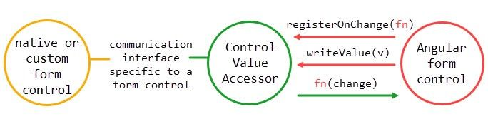

# Custom Form Control

```typescript
@Component({
  selector: "app-input",
  template: `
    <input type="text" placeholder="Scrivi..." />
  `,
  styleUrls: ["./input.component.scss"]
})
export class InputComponent implements OnInit {

  constructor() {}

  ngOnInit() {}
}
```

we need to tell Angular how to do a few things:

* Write a value to the input - _writeValue_
* Register a function to tell Angular when the value of the input changes - _registerOnChange_
* Register a function to tell Angular when the input has been touched - _registerOnTouched_
* Disable the input - _setDisabledState_

_ControlValueAccessor_ interface, the bridge between a form control and a native element or custom input component. Once our component implements that interface, we need to tell Angular about it by providing it as a _NG\_VALUE\_ACCESSOR_ so that it can be used




